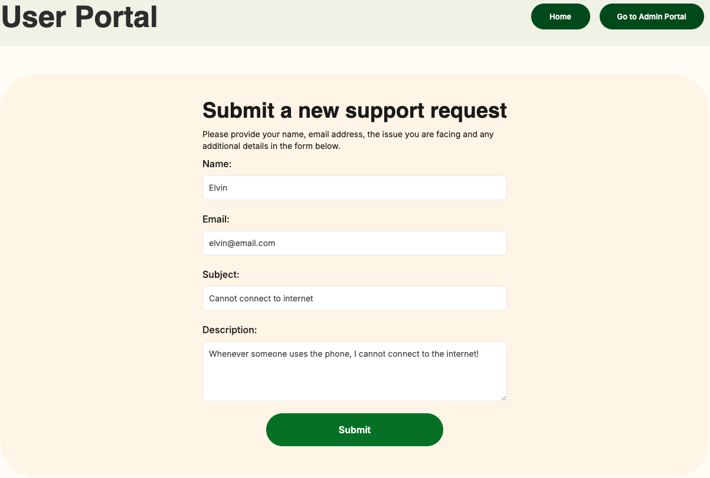
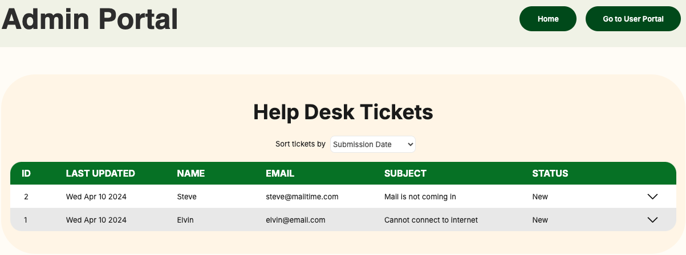
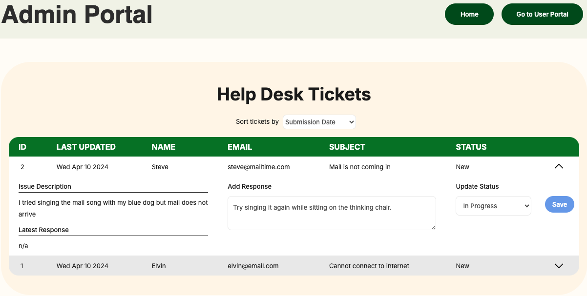

# Help Desk

This is a full stack application for a help desk / support ticket management system. Users can submit support ticket requests, while admins can view all of the tickets and provide responses and status updates to the users.

[Link to the Application](https://simple-helpdesk.vercel.app/)

## Core Features

1. Users can create new support tickets
2. Navigate between the User Portal and Admin Portal
3. Display and sort user-created tickets for admins
4. Admins can update the status and reply to each ticket

## Tech Stack

- TypeScript
- Next.js
- React
- PostgreSQL
- TailwindCSS
- Vercel

## How To Use Application

### User Portal

Users can submit a new help desk ticket by completing the form with the required information (name, email address, subject and description).

### Admin Portal

Admins can view and sort the user submitted tickets, and expand on each ticket to see more details.

After expanding, admins can update the ticket by writing a response and selecting the updated status. After saving changes, the admin portal will be updated with the latest information.

## Future Features

1. Perform unit, integration and end-to-end testing
2. Login functionality for users and admins using bcrypt hashing for passwords
3. Allow users to see their previously submitted tickets
4. Allow users and admins to delete a ticket
5. Allow admins to assign tickets to specific support staff member
6. Separate dashboards for completed/resolved tickets
7. Instant in-line validation for the user ticket submission form
8. Pop-out modal when expanding on tickets

## Running in Development Mode

- Fork and clone this repository
- `npm install`
- Create a `.env.local` file in the root directory
- Add 'PG_LINK=[your own database URI]' to the `.env.local` file
- `npm run dev`
- open http://localhost:3000/
